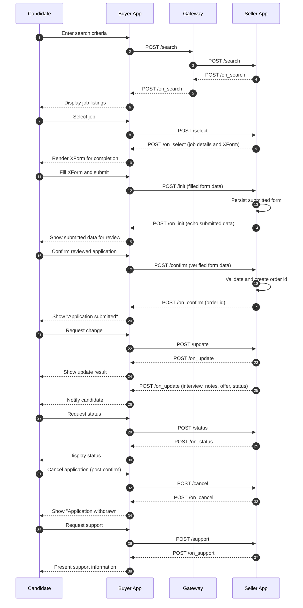

# Livelihood Domain – Example Payloads

This directory contains example request/response payloads for each Beckn 2.0 flow using the livelihood domain schema extension (`opun:livelihood`).

All examples use:

- `context.domain`: `opun:livelihood`
- `@context` / `schema_context`: [Beckn Core v2 context, Livelihood v1 context]

---

## User Stories

User stories describe who does what in the livelihood (recruitment/job-application) flow. Actors: **Job Seeker** (via BAP), **Employer / Provider** (BPP), and **BAP** (buyer app) / **BPP** (seller app) as network participants.

### Job Seeker (BAP side)

| # | Story | Flow(s) | Example payloads |
|---|--------|---------|-------------------|
| 1 | As a job seeker, I want to discover employers or catalogs so that I can find job opportunities. | Discover | `discover.json` → `on_discover.json` |
| 2 | As a job seeker, I want to search for jobs by keywords, location, work mode, or disability-friendly filters so that I see relevant listings. | Search | `search.json` → `on_search.json` |
| 3 | As a job seeker, I want to select a job to see full details and the application form so that I can decide to apply. | Select | `select.json` → `on_select.json` |
| 4 | As a job seeker, I want to submit an application with my profile and filled form (XForms 2.0) so that the employer receives it. | Init | `init.json` → `on_init.json` |
| 5 | As a job seeker, I want to confirm my application after review so that it is formally submitted. | Confirm | `confirm.json` → `on_confirm.json` |
| 6 | As a job seeker, I want to check the status of my application (e.g. in review, shortlisted, offered). | Status | `status.json` → `on_status.json` |
| 7 | As a job seeker, I want to update my contact details on an existing application. | Update | `update/update.json` (BUYER_CONTACT_UPDATE) → `on_update` |
| 8 | As a job seeker, I want to accept or decline a job offer so that the employer knows my decision. | Update | `update/update_job_offer_accepted.json` (BUYER_OFFER_ACCEPTANCE) → `on_update` |
| 9 | As a job seeker, I want to confirm my joining date so that onboarding can be planned. | Update | `update/update_joining_confirmed.json` (JOINING_CONFIRMED) → `on_update` |
| 10 | As a job seeker, I want to get support (e.g. application or hiring process) when I have questions. | Support | `support.json` → `on_support.json` |
| 11 | As a job seeker, I want to withdraw my application when I no longer wish to be considered. | Cancel | `cancel.json` → `on_cancel.json` |

### Employer / Provider (BPP side)

| # | Story | Flow(s) | Example payloads |
|---|--------|---------|-------------------|
| 1 | As an employer, I want to publish my job catalog so that job seekers can discover and search it. | Discover (catalog) | `catalog_publish.json`, `on_discover.json` |
| 2 | As an employer, I want to return relevant job results for a search so that candidates can choose roles. | Search | `on_search.json` |
| 3 | As an employer, I want to return full job details and application form (XForms 2.0) when a job is selected. | Select | `on_select.json` |
| 4 | As an employer, I want to receive and validate an application (form + profile) and return an order/application id. | Init | `on_init.json` |
| 5 | As an employer, I want to confirm receipt of the application and set initial status (e.g. DRAFT, SUBMITTED). | Confirm | `on_confirm.json` |
| 6 | As an employer, I want to return current application/order status when the candidate checks. | Status | `on_status.json` |
| 7 | As an employer, I want to notify the candidate when status changes (e.g. in review, shortlisted, offer sent, joining confirmed). | Update | `on_update.json`, `on_update_shortlisted.json`, `on_update_job_offer.json`, `on_update_job_offer_accepted.json`, `on_update_joining_confirmed.json` |
| 8 | As an employer, I want to provide support contact or ticket details when support is requested. | Support | `on_support.json` |
| 9 | As an employer, I want to acknowledge withdrawal when the candidate or I cancel the application or reject an application. | Cancel | `on_cancel.json` |

### Flow summary

- **BAP** sends: `discover`, `search`, `select`, `init`, `confirm`, `status`, `update`, `support`, `cancel`.
- **BPP** responds with: `on_*` for each action (e.g. `on_search`, `on_select`, `on_init`, `on_confirm`, `on_update`, etc.).
- **Update** is used for both: (1) BAP-initiated changes (contact update, offer acceptance, joining confirmation) and (2) BPP-initiated status notifications (in review, shortlisted, offer letter, offer accepted, joining confirmed). The same `transaction_id` / `order.id` ties the conversation.

---

## Flow (Sequence)

Each Beckn action is a **request (BAP → BPP)** and **response (BPP → BAP)** pair. The livelihood flow typically follows this sequence:

**Flow Diagram**

### Flow-to-file mapping

| Step | Action | Request (BAP → BPP) | Response (BPP → BAP) |
|------|--------|----------------------|-----------------------|
| 1 | Discover | `discover/discover.json` | `discover/on_discover.json` |
| 2 | Search | `search/search.json` | `search/on_search.json` |
| 3 | Select | `select/select.json` | `select/on_select.json` |
| 4 | Init | `init/init.json` | `init/on_init.json` |
| 5 | Confirm | `confirm/confirm.json` | `confirm/on_confirm.json` |
| 6 | Status | `status/status.json` | `status/on_status.json` |
| 7 | Update | `update/update.json`, `update_job_offer_accepted.json`, `update_joining_confirmed.json` | `update/on_update.json`, `on_update_shortlisted.json`, `on_update_job_offer.json`, `on_update_job_offer_accepted.json`, `on_update_joining_confirmed.json` |
| 8 | Support | `support/support.json` | `support/on_support.json` |
| 9 | Cancel | `cancel/cancel.json` | `cancel/on_cancel.json` |

### Update flow variants (livelihood)

Within **update** / **on_update**, the same `transaction_id` and `order.id` are used; `updateType` and `fulfillmentStatus` / `applicationStatus` distinguish the variant:

| Variant | Direction | updateType / intent | Example file(s) |
|---------|-----------|----------------------|------------------|
| Contact update | BAP → BPP | `BUYER_CONTACT_UPDATE` | `update/update.json` → `on_update` |
| Status: In review | BPP → BAP | `STATUS_UPDATE` | `update/on_update.json` |
| Status: Shortlisted | BPP → BAP | `STATUS_UPDATE` | `update/on_update_shortlisted.json` |
| Job offer (letter) | BPP → BAP | `STATUS_UPDATE` | `update/on_update_job_offer.json` |
| Offer accepted | BAP → BPP then BPP → BAP | `BUYER_OFFER_ACCEPTANCE` then `STATUS_UPDATE` | `update/update_job_offer_accepted.json` → `on_update_job_offer_accepted.json` |
| Joining confirmed | BAP → BPP and/or BPP → BAP | `JOINING_CONFIRMED` | `update/update_joining_confirmed.json`, `update/on_update_joining_confirmed.json` |

Application form data follows **XForms 2.0**: the form structure is provided in **on_select** (`xinput.form.data`); the filled form is sent in **init** and echoed in **confirm** via `opun:applicationForm.opun:formData`.

---

## Payloads

### Discover Flow

- **discover.json** – BAP requests discovery of BPPs or catalogs (e.g. with filters such as disability type, work mode, location).
- **on_discover.json** – BPP/gateway returns list of providers or catalogs.
- **catalog_publish.json** – Catalog publication payload for job opportunity listings.

**Key elements:** Criteria filters (e.g. `opun:workMode`, `opun:disabilityType`), spatial constraints, catalog references.

### Search Flow

- **search.json** – Job seeker/BAP searches for job opportunities (keywords, filters).
- **on_search.json** – BPP returns catalog with job items and livelihood attributes (e.g. `LivelihoodJobOpportunity`, salary, location, accessibility metadata).

**Key elements:** Intent (item/category), tags for filters; catalog with `beckn:items` and `opun:itemAttributes` (job details, application form, interview process).

### Select Flow

- **select.json** – Job seeker selects a specific job to view details and application form.
- **on_select.json** – BPP returns full job details, application form (XInput), and provider info.

**Key elements:** Item id, fulfillment id; response with descriptor, `opun:applicationForm`, fee/quote if applicable.

### Init Flow

- **init.json** – Job seeker submits application with filled form, candidate profile, documents.
- **on_init.json** – BPP acknowledges and returns order/application id (pending confirmation).

**Key elements:** Order/application payload, buyer (candidate), fulfillment, payment if applicable, form response (XInput).

### Confirm Flow

- **confirm.json** – Job seeker or BAP confirms the application (after review).
- **on_confirm.json** – BPP confirms application; order/application status moves to confirmed.

**Key elements:** Order id, confirmation details; response with order and fulfillment state.

### Status Flow

- **status.json** – Job seeker/BAP requests current application/order status.
- **on_status.json** – BPP returns current order and fulfillment state (e.g. application status, interview stage, offer status).

**Key elements:** Order id; response with order, fulfillment, and livelihood-specific status attributes (e.g. `applicationStatus`, interview stages).

### Update Flow

- **update.json** – Request to update order/fulfillment (e.g. candidate contact, job offer response, joining confirmation).
- **on_update.json** – BPP acknowledges update (e.g. contact updated, offer accepted/declined, joining confirmed).

**Update types (examples):** `BUYER_CONTACT_UPDATE`, job offer acceptance/decline, joining confirmed. Additional examples in the `update/` folder (e.g. `on_update_job_offer.json`, `on_update_joining_confirmed.json`).

### Support Flow

- **support.json** – Request for support (e.g. application or hiring process).
- **on_support.json** – BPP returns support contact or ticket details.

### Cancel Flow

- **cancel.json** – Job seeker or BPP cancels application/order.
- **on_cancel.json** – Cancellation acknowledged; order/fulfillment status updated.

**Key elements:** Order id, cancellation reason; response with updated order/fulfillment state.

## Application Lifecycle

The examples demonstrate the recruitment lifecycle:

1. **Discover** → Find providers/catalogs
2. **Search** → Find job opportunities
3. **Select** → View job details and application form
4. **Init** → Submit application
5. **Confirm** → Application confirmed
6. **Status** → Track application and interview progress
7. **Update** → Offer response, joining confirmation, contact updates
8. **Support** → Get help
9. **Cancel** → Withdraw application if needed

## Schema Reference

For entity definitions, attribute scopes, and types, see the [Livelihood schema extension](../schema-extension/README.md) in this repository.

---

## Matching payloads to user stories

- **User stories** above list the actor (job seeker vs employer), the intent, and the flow(s) and example files.
- **Flow** above shows the request–response pairs and the typical sequence (discover → search → select → init → confirm → status/update/support/cancel).
- **Payloads** in each subfolder (`discover/`, `search/`, `select/`, `init/`, `confirm/`, `status/`, `update/`, `support/`, `cancel/`) are sample JSON that match these flows and can be used to validate implementations and align with signed user stories.
